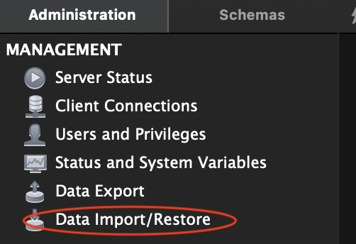
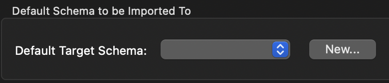
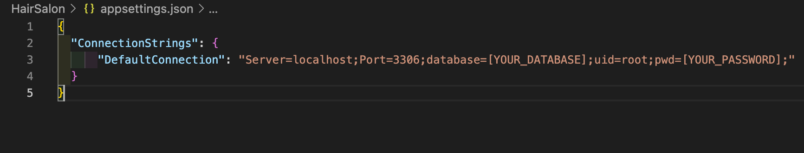

# _Fringe Society: By Eau Claire Studios_

#### _An MVC application that allows a fictional salon owner to track their stylists and each stylist's associated clients_

#### By _**Chloe Loveall**_
<br>

 &nbsp;  &nbsp;  &nbsp;  &nbsp;  &nbsp; 

## Table of Contents

1. [Table of Contents](#table-of-contents)
2. [Description](#description)
3. [Preview](#preview)
4. [Technologies Used](#technologies-used)
5. [Setup and Installation Requirements](#setup-and-installation-requirements)
    * [Prior to Installation](#prior-to-installation)
      * [Git Installation](#confirm-you-have-git-installed)
      * [.NET Installation](#confirm-you-have-.net-installed)
    * [Installation](#installation)
    * [Database Setup](#database-setup)
      * [MySQL Password Protection](#mysql-password-protection)
6. [User Stories](#user-stories)
7. [Specifications](#specifications)
8. [Known Bugs](#known-bugs)
9. [Issues](#issues)
10. [Roadmap](#roadmap)
11. [Design](#design)
12. [Contributing](#contributing)
13. [License](#license)
14. [Acknowledgements](#acknowledgements)
15. [Contact Information](#contact-information)

## Description

An [Epicodus](https://www.epicodus.com/) project to create an MVC web application to help a fictional salon owner manage her employees and their clients. The salon owner can add a list of stylists working at the salon, and for each stylist, add clients who see that stylist. The stylists have specific specialties, so each client can only see a single stylist.

## Preview

Live preview on GH Pages: gh-pages

## Technologies Used

* ASP.NET
* C#
* Entity Framework
* MSTest
* MySQL 8.0.15
* MySQL Workbench 8.0.15
* .NET 5.0
* Razor

## Setup and Installation Requirements

### Prior to Installation

#### Confirm you have Git installed
  * Installing Git on Macs:
    * Install the package manager [Homebrew](https://brew.sh/) by copying and pasting the following in the terminal: ```$ /usr/bin/ruby -e "$(curl -fsSL https://raw.githubusercontent.com/Homebrew/install/master/install)"```
    * Copy and paste once of the following lines in the terminal so that Homebrew packages are run before the system versions of the same packages:
      * For bash users: ```$ echo 'export PATH=/usr/local/bin:$PATH' >> ~/.bash_profile```
      * For zsh users: ```$ echo 'export PATH=/usr/local/bin:$PATH' >> ~/.zshrc```
    * Last, install Git with the following terminal command: ```$ brew install git```

  * Installing Git on Windows:
    * Open Command Prompt, the Windows terminal program. You can access it by typing ```Cmd``` in the search bar in the bottom left corner.
    * **NOTE** There are many options available, but we recommend using a free program called [Git Bash](https://gitforwindows.org/)
    * Navigate to [Git Bash](https://gitforwindows.org/) and click on the Download button. This will take you to a page with the latest version of Git Bash. Determine whether you have 32-bit or 64-bit Windows by following these instructions. Then download the corresponding exe file from the Git for Windows site. (If you have a package manager already installed, you can also choose to download the tar.bz2 version.)
    * Click on the downloaded file and then follow the instructions in the Setup menu until you reach the Install button and install the package.
    
#### Confirm you have .NET installed 
Installing .NET will provide provide access to the C# language
  * [.NET for macOS](https://dotnet.microsoft.com/download/dotnet/thank-you/sdk-5.0.100-macos-x64-installer)
  * [.NET for Windows](https://dotnet.microsoft.com/download/dotnet/thank-you/sdk-5.0.102-windows-x64-installer)
* Additionally, you may want to install a REPL to allow you to practice, test, and experiment with C#. Below are instructions for the ```dotnet script``` REPL:
  * Install ```dotnet script``` by running the following terminal command: ```$ dotnet tool install -g dotnet-script```
  * **NOTE:** If you just installed .NET 5, restart the terminal. (Otherwise, you will not be able to run the following command.) 
    * Enter ```$ dotnet script``` in your terminal and a prompt will open: ```>```
    * To exit the REPL press: Ctrl +C

### Installation
* Clone the repository with the following git terminal command: ```$ git clone https://github.com/chloeloveall/HairSalon.Solution.git```
* Open the project directory in your terminal
* Navigate to the ```HairSalon``` directory
    * To create ```obj``` directories in both production and test projects, run the terminal command: ```$ dotnet restore```
    * **NOTE**: Do not touch the code in either ```obj``` directory.
* To launch the program, run the terminal command: ```dotnet run```

### Database Setup 
* Confirm you have [MySQL](https://dev.mysql.com/downloads/file/?id=484914) installed
* Confirm you have [MySQL Workbench](https://dev.mysql.com/downloads/file/?id=484391) installed
* Open ```MySQL Workbench``` and select ```Local Instance 3306```
* In the ```Administration``` tab, select ```Data Import/Restore```
  * 
* Select ```Import from Self-Contained File```
* Select the file ```chloe_loveall.sql``` from the ```HairSalon.Solutions``` root directory
* Select ```New``` from the ```Default Schema to be Imported To``` section
  * 
* Choose a name for the database and select ```Ok```
* Select ```Start Import```

#### MySQL Password Protection
* Create a the following file: ```appsettings.json```
* Add the following code:
  * 
* **NOTE**: [YOUR_DATABASE] must match the database name you chose to import above
* **NOTE**: [YOUR_PASSWORD] must match your local MySQL server password
* **NOTE**: The ```appsettings.json``` file is included in the ```.gitignore``` file 
  * You can read more about best practices for storing private information with ASP.NET Core [here](https://www.humankode.com/asp-net-core/asp-net-core-configuration-best-practices-for-keeping-secrets-out-of-source-control)
  
## User Stories

* As the salon owner, I need to be able to see a list of all stylists.
* As the salon owner, I need to be able to select a stylist, see their details, and see a list of all clients that belong to that stylist.
* As the salon owner, I need to add new stylists to our system when they are hired.
* As the salon owner, I need to be able to add new clients to a specific stylist. I should not be able to add a client if no stylists have been added.

## Specifications

| Behavior                                                         | Input                      | Output                     |
| ---------------------------------------------------------------- | :------------------------- | :------------------------- |
| Program will begin on a splash page                              | user runs program          | localhost:5000/            |
| User can click a link to be directed to a stylists page          | user clicks link           | localhost:5000/stylists    |
| User can add a stylist to a list                                 | "Janet Weiss"              | "Janet Weiss"              |
| User can add multiple properties to each stylist                 |                            |                            |
| User will be routed to stylist index page after stylist is added | user adds stylist          | localhost:5000/stylists    |
| User can click stylist's name and view all associated details    | user clicks "Janet Weiss"  | localhost:5000/suziescafe  |
| User can click stylist's name and view all associated clients    | user clicks "Janet Weiss"  | localhost:5000/suziescafe  |
| User can click a link to be directed to a clients page           | user clicks link           | localhost:5000/clients     |
| User can add a client to a list                                  | "Riff Raff"                | "Riff Raff"                |
| User can add multiple properties to each client                  |                            |                            |
| User can add a client to a stylist                               |                            |                            |
| User will be routed to client index page after stylist is added  | user adds client           | localhost:5000/clients     |
| User can click client's name and view all associated details     | user clicks "Jane Doe"     | localhost:5000/suziescafe  |

## Known Bugs

* None at this time

## Issues 

* Report issues [here](https://github.com/chloeloveall/HairSalon.Solution/issues) and select the ```New issue``` button
for support and

## Roadmap

* Include a form where employees may search for a stylist by name. Display a list of all results
* Include a form where employees may also search for a client by name. Display a list of all results
* Add a feature for adding an appointment to a client
* Add a feature for adding an appointment to a stylist. Add a check to make sure the stylist does not have any conflicting appointments
* Add a feature for keeping track of how much each stylist was paid for each appointment
* Add styling beyond splash page

### Design

## Contributing

Contributions are what make the open source community such an amazing place to be learn, inspire, and create. Any contributions you make are greatly appreciated.

1. Fork the project on GirHub
    * Follow [Installation and Setup Requirements](#setup-and-installation-requirements) above
2. Create your Feature Branch: ```$ git checkout -b YourFeatureBranchName```
3. Commit your Changes ```$ git commit -m 'Add some Amazing Feature'```
4. Push to your feature branch on Github ```$ git push origin YourFeatureBranchName```
5. Open a Pull Request

## License

[MIT](LICENSE.md)

## Acknowledgements

* [Canva](https://www.canva.com/)
* [Choose an open source license](https://choosealicense.com/)
* [Coolors](https://coolors.co/)
* [Microsoft C# Documentation](https://docs.microsoft.com/en-us/dotnet/csharp/)
* [Pexels: Royalty Free Images](https://www.pexels.com/royalty-free-images/)
* [Shields](https://shields.io/)
* [Unplash: Photos for Everyone](https://unsplash.com/)

## Contact Information

_Chloe Loveall <chloeloveall@protonmail.com>_

 &nbsp;  &nbsp; 

[Back to Top](#table-of-contents)